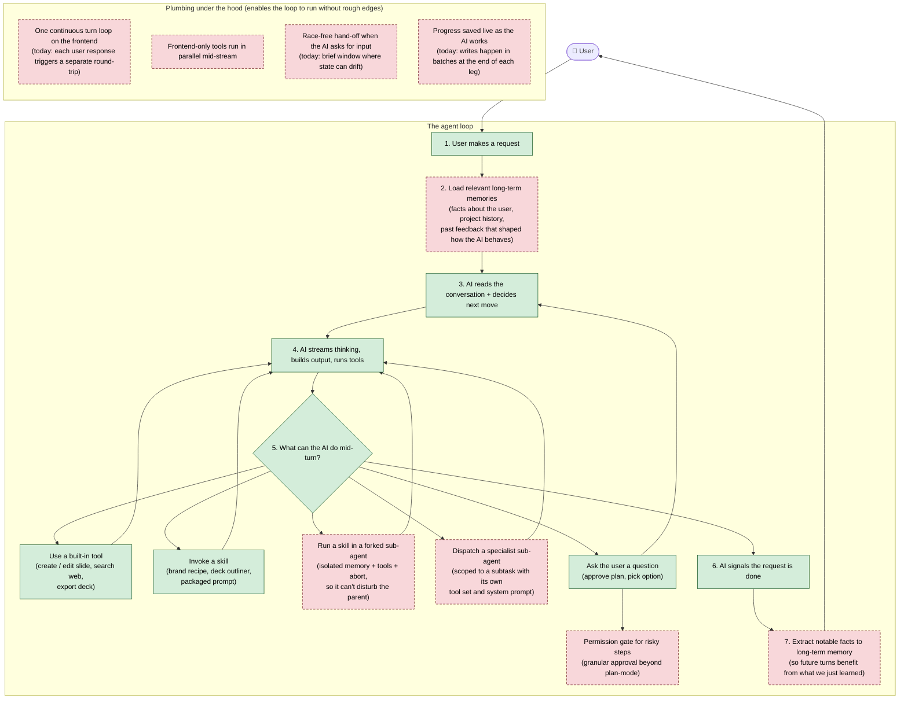

# The Agent Loop

This is what Edwin's agent does on every turn. The green path works today. The red items are still missing — they unlock new capabilities and remove the rough edges.

## Legend

- 🟢 **Green** — works in Edwin today.
- 🔴 **Red dashed** — still to come. Either a new capability the AI doesn't have yet (long-term memory, sub-agents, forked skills, granular permission gates) or a structural improvement that makes today's flow more robust.

## What each delta unlocks

| Missing piece | What it enables |
|---|---|
| **Long-term memory (load + extract)** | The AI carries useful context between conversations — user preferences, project specifics, past feedback — so it doesn't relearn the same things each session. |
| **Forked skills** | A skill can run in an isolated sandbox: its own memory, its own tool subset, its own abort signal. Useful for skills that change brand, language, or persona without polluting the parent conversation. |
| **Sub-agent dispatch** | The AI can hand off a subtask to a specialist mini-agent (with its own tools and prompt), get the result, and continue — instead of doing everything itself. |
| **Permission gates** | Granular "ask before this action" beyond the plan-mode coarse approval — so high-risk steps (overwrites, exports, deletions) can require explicit consent. |
| **Plumbing improvements** | The four items in the bottom group together remove the class of bugs where state drifts when the user clicks too quickly, or where slides duplicate, or where the streaming UI doesn't refresh after approval. |
